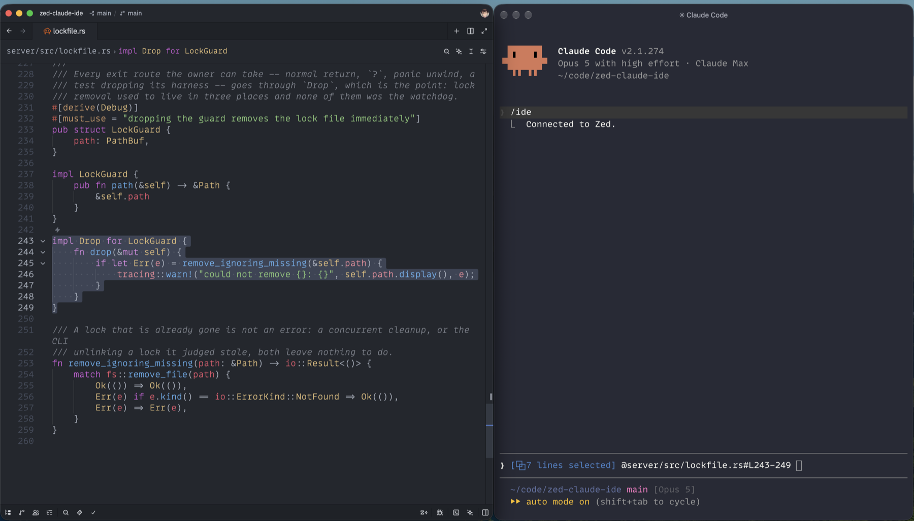

# Claude Code Connect



Makes the `claude` CLI aware of what you are looking at in Zed — the active file
and the current selection — the way the Claude Code extension does in VS Code.

Works with the CLI running in **any terminal**, including a separate one like
Ghostty or iTerm. It does not need to run inside Zed's integrated terminal.

```
Zed ──LSP(stdio)──> claude-code-connect ──WebSocket(MCP)──> claude
 │                    │                                         ▲
 │                    ├─ writes ~/.claude/ide/<port>.lock ───────┘
 └─ WASM extension ───┘                                     (discovery)
```

Full design notes: [docs/architecture.md](docs/architecture.md).

## Why a companion process

A Zed extension on its own cannot do this, and not by a small margin:

- **It cannot open a socket.** Zed's extension host builds the WASI context with
  stdio and two preopened directories, and never links `wasi:sockets`. There is no
  `bind()` available to a WASM extension at any privilege level.
- **It cannot see the editor.** The extension API has no buffer, pane, editor or
  selection type. `Project` exposes exactly one method, `worktree_ids()`. Extensions
  are functions Zed calls, not subscribers to editor events.

So the extension is a thin stub whose only job is to tell Zed to spawn a native
companion as a language server. The companion is where everything actually happens:
it owns the WebSocket server, the lock file, the MCP tools, and a mirror of your
open buffers. Editor state reaches it over LSP document sync.

Zed maintainers have acknowledged this class of integration as something that
"should be doable with an extension in the future (but isn't right now)"
([zed#58338](https://github.com/zed-industries/zed/discussions/58338)).

## What works

| | |
|---|---|
| Active file | Yes, via LSP document sync |
| Selection | Yes — Zed passes the live range on `textDocument/codeAction` |
| Unsaved edits | Yes — selections read from a buffer mirror, not from disk |
| `@`-mention hotkey | See [At-mentions](#at-mentions) — needs user-level config |
| Diff review UI | **No.** See [Limits](#limits) |
| Diagnostics | **No.** See [Limits](#limits) |

## Install

In Zed: `cmd-shift-p` → `zed: install dev extension` → select the `extension/`
directory (the one containing `extension.toml`).

That is all. The extension downloads the companion binary for your platform from
this repository's latest release, caches it, and runs it. Nothing to build, and
no Rust toolchain needed.

Open a file in a project. The companion starts and writes
`~/.claude/ide/<port>.lock`. Then, in your terminal, `cd` into that project and run
`claude`, followed by `/ide` — pick **Zed**.

To skip the `/ide` step, put this in your shell profile:

```sh
export CLAUDE_CODE_AUTO_CONNECT_IDE=true
```

Do **not** set `FORCE_CODE_TERMINAL`. It makes the CLI believe it is running inside
an IDE's own terminal, which turns on a check that the lock file's `pid` be an
ancestor of the CLI process — never true from a separate terminal.

### Running your own build

Only needed if you are changing the companion. Requires Rust:

```sh
cargo build --release -p claude-code-connect
```

Then point the extension at it in `~/.config/zed/settings.json`:

```json
"lsp": {
  "claude-code-connect": {
    "binary": { "path": "/absolute/path/to/target/release/claude-code-connect" }
  }
}
```

This setting wins over the download, so **remove it** when you want to test what a
normal install does.

## How discovery works

The editor is the MCP server and the CLI is the client, which is the reverse of what
most people assume.

1. The companion binds `127.0.0.1` on a random free port in `[10000, 65535]`.
2. It writes `~/.claude/ide/<port>.lock`, mode `0600`, in a `0700` directory.
   The port is taken from the **filename**; the JSON is:
   ```json
   {"pid": 1234, "workspaceFolders": ["/abs/path"], "ideName": "Zed",
    "transport": "ws", "runningInWindows": false, "authToken": "<uuid>"}
   ```
3. The CLI scans that directory and accepts a lock when its working directory is at
   or under one of `workspaceFolders`. It checks `pid` only when run from an IDE's
   own terminal, and never deletes a lock, so the companion removes its own on
   every exit and sweeps any it left behind at the next start.
4. It connects to `ws://127.0.0.1:<port>` offering subprotocol `mcp` and the header
   `X-Claude-Code-Ide-Authorization`, then speaks MCP JSON-RPC 2.0, one object per
   text frame.

One companion runs per Zed window, each with its own port and token, so several
projects can be open at once and each `claude` attaches to the right one.

## At-mentions

Press a key, and the file and lines you have selected in Zed are pinned into the
`claude` prompt as `@path/to/file.rs#L12-20`. Unlike the live selection, a mention
**stays** — press it in several files and they stack up.

Zed extensions cannot register commands or keybindings at `schema_version = 1`.
A Zed *task* can run a command and be bound to a key, so the hotkey is three
pieces of your own config rather than something the extension ships.

### 1. Find the helper

Nothing to install. The at-mention helper is the companion binary with a
subcommand, and the extension already put a copy under a fixed name beside the
versioned one it runs:

```
~/Library/Application Support/Zed/extensions/work/claude-code-connect/claude-code-connect
```

On Linux, `~/.local/share/zed/extensions/work/claude-code-connect/claude-code-connect`.

That name does not change between releases, which is the point — a Zed task takes
a fixed command string, so a path with a version in it would break on the next
update.

If you would rather have it on your `PATH`, copy or link it:

```sh
ln -sf ~/Library/Application\ Support/Zed/extensions/work/claude-code-connect/claude-code-connect \
   ~/.local/bin/claude-code-connect
```

### 2. Add the task

`~/.config/zed/tasks.json` — append to the array:

```json
{
  "label": "Claude: mention selection",
  "command": "/Users/YOU/Library/Application Support/Zed/extensions/work/claude-code-connect/claude-code-connect",
  "args": ["at-mention", "--worktree", "$ZED_WORKTREE_ROOT"],
  "use_new_terminal": false,
  "allow_concurrent_runs": true,
  "reveal": "never",
  "hide": "always",
  "save": "none",
  "show_summary": false,
  "show_command": false
}
```

`reveal: never` and `hide: always` stop it stealing focus or leaving a terminal tab
behind. `save: none` matters: the companion reads your *unsaved* buffer, so there
is nothing to flush first.

### 3. Bind a key

`~/.config/zed/keymap.json` — append to the array:

```json
{
  "context": "Editor && mode == full",
  "bindings": {
    "cmd-alt-k": ["task::Spawn", { "task_name": "Claude: mention selection" }]
  }
}
```

`cmd-alt-k` mirrors VS Code. If your `base_keymap` is JetBrains or Sublime, check
for a conflict first: `zed: open default keymap`, then search for the chord.

Restart Zed — tasks and keymaps are read at startup.

### Using it

Select something, press `cmd-alt-k`. **Zed shows nothing** — the task runs hidden,
and the companion has no way to post back into the editor. Look at the `claude`
prompt instead:

```
[15 lines selected] @server/tests/lockfile.rs#L241-255 @server/src/main.rs#L12
```

Three different things are visible there:

| | |
|---|---|
| `[15 lines selected]` | **live**, from the current selection; changes as you move |
| `@…#L241-255` | a **pinned** mention, from one keypress |
| `@…#L12` | another, from a different file |

A mention carries **lines only, not columns**. Select a single word and you get
that word's line. The CLI's wire format has no field for a column, so this is a
limit of the protocol rather than a choice.

With nothing selected, a mention carries just the file.

### If nothing happens

```sh
# Does the helper find a running companion?
claude-code-connect at-mention --debug --worktree "$PWD"
```

It prints which port it reached. To watch the wire directly:

```sh
cargo run -p claude-code-connect --example watch -- /path/to/project
```

Move the cursor and you will see `selection_changed`; press the key and you will
see `at_mentioned`.

More detail in [`docs/at-mentions.md`](docs/at-mentions.md).

## Limits

These are structural, not a to-do list:

- **No diff review.** `openDiff` requires an editor surface that Zed exposes to
  extensions in no form. Every project in this lineage omits it.
- **No diagnostics.** The companion is one language server among many, and Zed does
  not forward other servers' `publishDiagnostics` to it. `getDiagnostics` is
  therefore not advertised at all, rather than advertised and always empty — of the
  twelve IDE tools, only `executeCode` and `getDiagnostics` are ever shown to the
  model, so an always-empty one is worse than none.
- **Activation is language-gated.** Registration goes through
  `language_server_command`, so the companion starts when you open a file whose
  language is listed in `extension.toml`. `"Plain Text"` is included to make this
  fire early, but a project of only exotic file types may not start it.

## Development

```sh
cargo test                      # unit + fake-CLI integration tests
cargo build --release -p claude-code-connect
cargo run -p claude-code-connect --example watch   # list running companions
cargo run -p claude-code-connect --example watch -- /path/to/project
```

`examples/watch` connects exactly as the CLI does and prints every notification the
companion pushes, with timestamps — the quickest way to see whether selection is
flowing.

After changing the server, `editor: restart language server` in Zed picks up the new
binary; no extension reinstall needed. After changing the extension, re-run
`zed: install dev extension`.

`CLAUDE_CODE_CONNECT_DIR` overrides the lock directory. `CLAUDE_CODE_IDE_SKIP_VALID_CHECK=true` makes the
CLI accept any lock regardless of working directory — useful when debugging a
connection, and not something to leave set, since it is the only thing stopping the
CLI attaching to a different project's companion.

## Credit

Derived from [`celve/claude-code-zed`](https://github.com/celve/claude-code-zed),
itself a fork of the archived `isomoes/claude-code-zed`. Both MIT; see
[`NOTICE`](NOTICE) for what changed and why.

The protocol was reconstructed by reading the shipped VS Code extension and the
`claude` binary (v2.1.269). [`docs/architecture.md`](docs/architecture.md) describes
it; [`REVERSE.md`](REVERSE.md) covers how it was determined and how to re-verify it.
